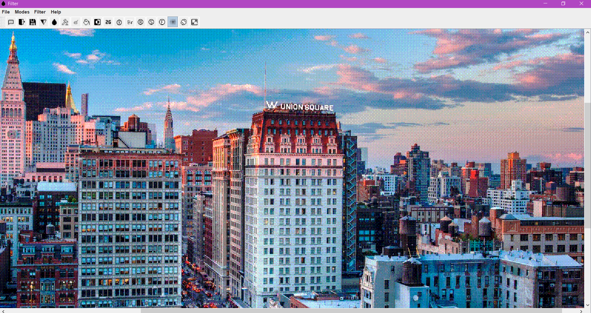

# Filter-Graphics_2
Application which is a copy of photoshop
This app made using: Swing Java, lombok, pom.xml



Filter application which contains filters:
Floyd, Ordered dither,  Roberts, Sobel, Blur, Emboss, Sharp, Aquarelle, Gamma, Grey, Inversion, Rotate
## How to launch it

Go to project folder, using terminal. Then type
```
cd Filter
java -jar target/detector.jar
```
